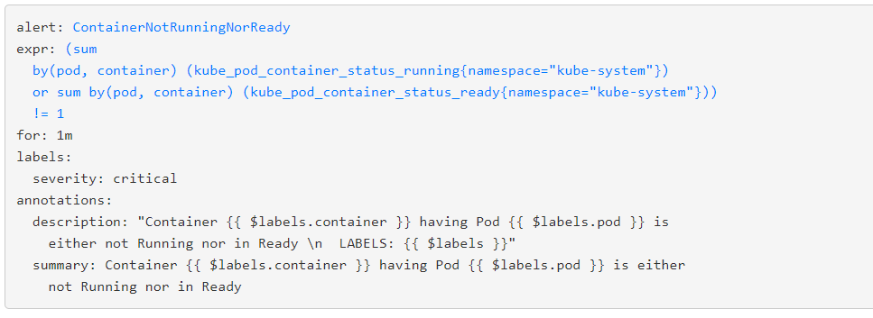
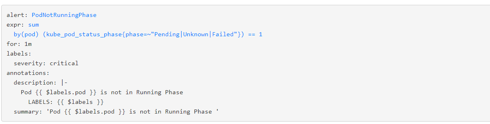

# Different Alerts for a kubernetes cluster
This git repo contains various well know alerts and the lists are
 - CEPH
 - Container (cAdvisor Metric based)
 - Elastic Search DB
 - ETCD Alerts
 - Free IPA (custom)
 - Kubernetes (kube-state-metrics)
 - Node (Node exporter based)
 - Prometheus & Alertmanager
 
 ContainerNotRunningNorReady: 
 PodNotRunningPhase: 
